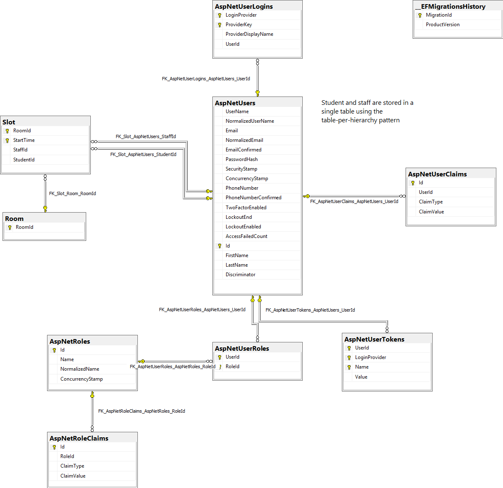

# Appointment Scheduling Reservation - WDT Assignment 2

## Contribution

GROUP Assignment 1 for RMIT Web Development Technologies.

### Student 1

**NAME:**  Shawn Taylor

**Student ID:** S3545751

### Student 2

**NAME:** Johnny Huynh

**Student ID:** S3604367

## Entity Relationship Diagram

This is a diagram generated by SQL Server Management Studio 2017 with all tables that function the appointment booking system.

## Social Media Authentication

The RMIT appointing scheduling application allows external authentication to utilize student and staff features. In our case we are currently using the Google+ API to authenticate users using the **OAuth2** protocol.

### Advantages & disadvantages offered by a social media login instead of the local login

Using a social media login provides security through the reliability of the social networking site and its infrastructure. They have the sole responsibility of storing the users confidential credentials.

Applications using the authentication mode will not need to store any passwords in the database. Credentials stored on a large organization such as Google or Microsoft would most likely have multiple points of failure compared to a simple application where credentials can lose its integrity.

A downside to having social media login would be that the user must have the account required from the social media provider. For example, if an application only has OAuth2 authentication for Google then the user must login an existing account or register a new account with Google. Additionally, applications tend to store any information scoped by the social media provider such as emails and full names, which means there would be a larger spread of the users information across the application and the provider.

## References

This is a list I've compiled, which has influenced code change and design pattern usage.

**Disclaimer:** I have not copied and will not copy referenced examples word for word.

### Concepts & design choices

- [ViewModel naming conventions](https://stackoverflow.com/questions/8883122/naming-conventions-regarding-view-models-to-avoid-long-names)
- [Using multiple DB contexts](https://stackoverflow.com/questions/52276128/net-core-2-1-multiple-dbcontext-for-same-database)
- [Creating multiple user identities](https://stackoverflow.com/questions/42163390/can-i-create-multiple-identity-tables-in-asp-net-mvc)

### Troubleshooting

- [Adding a model](https://docs.microsoft.com/en-us/aspnet/core/tutorials/first-mvc-app/adding-model?view=aspnetcore-2.1&tabs=visual-studio)
- [Basic ASP .NET Core authentication](http://jasonwatmore.com/post/2018/09/08/aspnet-core-21-basic-authentication-tutorial-with-example-api)
- [Entity Framework Core migrations](https://docs.microsoft.com/en-us/aspnet/core/data/ef-mvc/migrations?view=aspnetcore-2.0)
- [Testing controller logic](https://docs.microsoft.com/en-us/aspnet/core/mvc/controllers/testing?view=aspnetcore-2.1)
- [Integration testing in ASP .NET Core](https://docs.microsoft.com/en-us/aspnet/core/test/integration-tests?view=aspnetcore-2.1)

## License

This project is licensed under the MIT license, see [LICENSE](https://github.com/johnnyhuy/wdt-assignment-one/blob/master/LICENSE) for more information.
